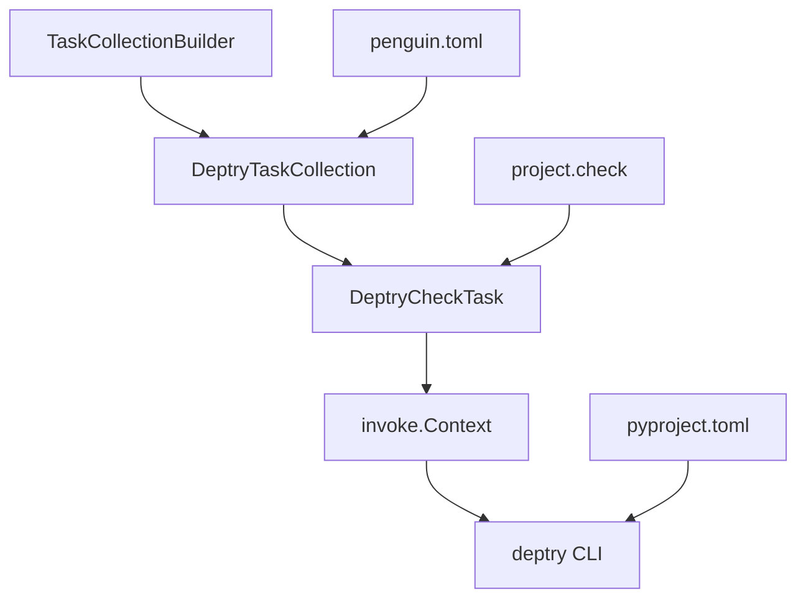

# Design Document

## Overview

The deptry task collection will integrate the deptry dependency analysis tool into the existing Python project template's task automation system. Deptry is already installed as a development dependency and configured in `pyproject.toml`. The implementation will follow the established patterns used by other check task collections like `pip_audit` and `vulture`.

The design leverages the existing task framework architecture, including:
- Task collection pattern with requirements and task building
- Check task properties for automatic inclusion in `project.check`
- Consistent logging and error handling
- Configuration management through TOML files

## Architecture

The deptry task collection follows the standard task collection architecture:

```
src/python_template_invoke_tasks/deptry/
├── __init__.py
├── task_collection.py      # DeptryTaskCollection class
└── check_task.py          # DeptryCheckTask class
```

### Component Relationships



## Components and Interfaces

### DeptryTaskCollection

**Purpose**: Manages the deptry task collection lifecycle and configuration.

**Key Responsibilities**:
- Register the collection with name "deptry"
- Define task requirements (none required for basic functionality)
- Build and return the DeptryCheckTask instance
- Provide collection metadata and description

**Interface**:
```python
class DeptryTaskCollection(TaskCollection):
    def __init__(self) -> None
    def _get_requirements_inner(self) -> list[TaskRequirement]
    def _build_tasks_inner(self, dependency_factory: DependencyFactory) -> list[Task]
```

### DeptryCheckTask

**Purpose**: Implements the actual deptry execution logic as an invoke task.

**Key Responsibilities**:
- Execute deptry command via poetry run
- Handle command output and error reporting
- Provide task metadata (is_check_task=True for auto-inclusion)
- Support command-line options for configuration

**Interface**:
```python
class DeptryCheckTask(Task):
    def __init__(self, path: str = "deptry.check") -> None
    @property
    def invoke_task(self) -> InvokeTask
```

**Task Parameters**:
- Standard deptry CLI options can be passed through
- Configuration will be read from `pyproject.toml` [tool.deptry] section

## Data Models

### Task Properties
```python
TaskProperties(
    is_check_task=True,  # Auto-include in project.check
    requires_internet=False  # Deptry analyzes local dependencies
)
```

### Configuration Model
The task will use the existing deptry configuration in `pyproject.toml`:
```toml
[tool.deptry]
per_rule_ignores = {"DEP003" = ["python_template_invoke_tasks"]}
```

Additional configuration can be added to `penguin.toml`:
```toml
[penguin.template.collection.deptry]
enabled = true

[penguin.template.collection.deptry.tasks.check]
# Future configuration options
```

## Error Handling

### Command Execution Errors
- **Deptry not found**: Task will fail with clear error message
- **Configuration errors**: Pass through deptry's error messages
- **Dependency issues found**: Exit with non-zero status code to fail CI builds
- **File system errors**: Handle gracefully with informative messages

### Error Categories
1. **Setup Errors**: Missing deptry installation, invalid configuration
2. **Analysis Errors**: Issues during dependency scanning
3. **Dependency Issues**: Unused/missing dependencies found (expected behavior)

### Error Reporting Strategy
- Use existing task logging framework (`self._logger`)
- Preserve deptry's original output format for familiarity
- Provide actionable error messages with suggested fixes
- Ensure CI-friendly exit codes

## Testing Strategy

### Unit Tests
- **DeptryTaskCollection Tests**:
  - Collection initialization and metadata
  - Requirements building (empty list expected)
  - Task building returns correct DeptryCheckTask instance

- **DeptryCheckTask Tests**:
  - Task initialization with correct properties
  - Invoke task creation and configuration
  - Command execution with various scenarios
  - Error handling for different failure modes

### Integration Tests
- **End-to-End Task Execution**:
  - Run deptry.check task in test environment
  - Verify output format and exit codes
  - Test with projects having dependency issues
  - Test with clean projects (no issues)

- **Configuration Integration**:
  - Test with various pyproject.toml configurations
  - Test penguin.toml integration
  - Verify task appears in project.check execution

### Test Data Requirements
- Sample projects with known dependency issues
- Clean test projects with proper dependencies
- Various deptry configuration scenarios
- Mock contexts for unit testing command execution

## Implementation Considerations

### Command Execution
- Use `poetry run deptry` to ensure correct environment
- Leverage `context.run()` with echo configuration from logging settings
- Pass through command-line arguments for flexibility

### Configuration Management
- Rely on deptry's built-in configuration discovery
- No need to manually parse pyproject.toml (deptry handles this)
- Support additional CLI options through task parameters

### Performance
- Deptry is typically fast for most projects
- No special performance optimizations needed initially
- Consider caching strategies if needed in future iterations

### Compatibility
- Works with existing Poetry-based dependency management
- Compatible with current CI/CD pipeline structure
- Follows established task collection patterns for consistency
